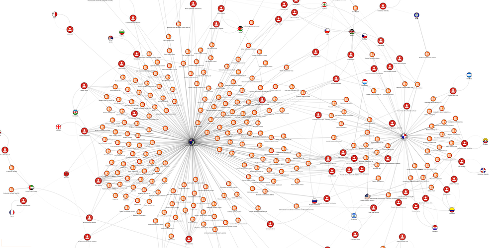

<p>
  <a href="https://github.com/memgraph/orb/actions">
    
  </a>
  <a href="https://github.com/memgraph/orb/blob/main/LICENSE">
    
  </a>
  <a href="https://www.npmjs.com/package/@memgraph/orb">
    
  </a>
  <a href="https://github.com/memgraph/orb/stargazers" alt="Stargazers">
    
  </a>
</p>



Orb is a graph visualization library. Read more about Orb in the following guides:

* [Handling nodes and edges](./docs/data.md)
* [Styling nodes and edges](./docs/styles.md)
* [Handling events](./docs/events.md)
* Using different views
  * [Default view](./docs/view-default.md) 
  * [Map view](./docs/view-map.md)

## Install

> **Important note**: Please note that there might be breaking changes in minor version upgrades until
> the Orb reaches version 1.0.0, so we recommend to either set strict version (`@memgraph/orb: "0.x.y"`)
> of the Orb in your `package.json` or to allow only fix updates (`@memgraph/orb: "~0.x.y"`).

### With `npm` (recommended)

```
npm install @memgraph/orb
```

Below you can find a simple TypeScript example using Orb to visualize a small graph. Feel
free to check other JavaScript examples in `examples/` directory.

```typescript
import { Orb } from '@memgraph/orb';
const container = document.getElementById('graph');

const nodes: MyNode[] = [
  { id: 1, label: 'Orb' },
  { id: 2, label: 'Graph' },
  { id: 3, label: 'Canvas' },
];
const edges: MyEdge[] = [
  { id: 1, start: 1, end: 2, label: 'DRAWS' },
  { id: 2, start: 2, end: 3, label: 'ON' },
];

const orb = new Orb<MyNode, MyEdge>(container);

// Initialize nodes and edges
orb.data.setup({ nodes, edges });

// Render and recenter the view
orb.view.render(() => {
  orb.view.recenter();
});
```

### With a direct link

> Note: Simulation with web workers is not supported when Orb is used with a direct
> link. Graph simulation will use the main thread, which will affect performance.

```html
<!-- Direct reference non-minified -->
<script src="dist/browser/orb.js"></script>
<!-- Direct reference minified -->
<script src="dist/browser/orb.min.js"></script>

<!-- unpkg CDN non-minified -->
<script src="https://unpkg.com/@memgraph/orb/dist/browser/orb.js"></script>
<!-- unpkg CDN minified -->
<script src="https://unpkg.com/@memgraph/orb/dist/browser/orb.min.js"></script>
```

Below you can find a simple JavaScript example using Orb to visualize a small graph. Feel
free to check other JavaScript examples in `examples/` directory.

```html
<!DOCTYPE html>
<html lang="en">
  <head>
    <meta charset="UTF-8" />
    <title>Orb | Simple graph</title>
    <script src="https://unpkg.com/@memgraph/orb/dist/browser/orb.min.js"></script>
    <style>
      #graph {
        border: 1px solid #e0e0e0;
        width: 600px;
        height: 600px;
      }
    </style>
  </head>
  <body>
    <div id="graph"></div>
    <script>
      const container = document.getElementById("graph");
    
      const nodes = [
        { id: 1, label: "Orb" },
        { id: 2, label: "Graph" },
        { id: 3, label: "Canvas" },
      ];
      const edges = [
        { id: 1, start: 1, end: 2, label: "DRAWS" },
        { id: 2, start: 2, end: 3, label: "ON" },
      ];
    
      // First `Orb` is just a namespace of the JS package 
      const orb = new Orb.Orb(container);
    
      // Initialize nodes and edges
      orb.data.setup({ nodes, edges });
    
      // Render and recenter the view
      orb.view.render(() => {
        orb.view.recenter();
      });
    </script>
  </body>
</html>
```

## Build

```
npm run build
```

## Test

```
npm run test
```

## Development

If you want to experiment, contribute, or simply play with the Orb locally, you can
set up your local development environment with:

* Installation of all project dependencies

  ```
  npm install
  ```

* Running webpack build in the watch mode

  ```
  npm run webpack:watch
  ```

* Running a local http server that will serve Orb and `examples/` directory on `localhost:8080`

  ```
  npm run serve
  ```

## License

Copyright (c) 2016-2022 [Memgraph Ltd.](https://memgraph.com)

Licensed under the Apache License, Version 2.0 (the "License"); you may not use
this file except in compliance with the License. You may obtain a copy of the
License at

     http://www.apache.org/licenses/LICENSE-2.0

Unless required by applicable law or agreed to in writing, software distributed
under the License is distributed on an "AS IS" BASIS, WITHOUT WARRANTIES OR
CONDITIONS OF ANY KIND, either express or implied. See the License for the
specific language governing permissions and limitations under the License.
