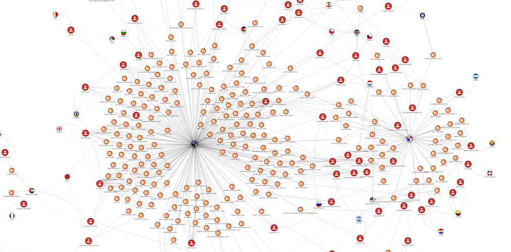

<p>
  <a href="https://github.com/memgraph/orb/actions">
    
  </a>
  <a href="https://github.com/memgraph/orb/blob/main/LICENSE">
    
  </a>
  <a href="https://www.npmjs.com/package/@memgraph/orb">
    
  </a>
  <a href="https://github.com/memgraph/orb/stargazers" alt="Stargazers">
    
  </a>
</p>



Orb is a graph visualization library. It renders interactive graphs on the 2D Canvas or on
WebGL, runs force-directed (CPU or GPU), circular, grid, and hierarchical layouts, plots
geo-located nodes on a map, and gives you full control over the style of every node and edge.

## Documentation

Full guides, the API reference, and live interactive demos are on the documentation site:

**https://memgraph.github.io/orb/**

Some good places to start:

* [Getting started](https://memgraph.github.io/orb/introduction/getting-started)
* [Graph data](https://memgraph.github.io/orb/concepts/data) - nodes, edges, and updates
* [Styling](https://memgraph.github.io/orb/concepts/styling) - colors, shapes, borders, labels
* [Events](https://memgraph.github.io/orb/concepts/events) and [Interaction](https://memgraph.github.io/orb/concepts/interaction)
* [Layouts](https://memgraph.github.io/orb/layouts/overview) - force, GPU, and static layouts
* [Canvas vs WebGL](https://memgraph.github.io/orb/rendering/renderers)
* [Map view](https://memgraph.github.io/orb/views/map)
* [API reference](https://memgraph.github.io/orb/reference/api)

## Install

### With `npm` (recommended)

```
npm install @memgraph/orb
```

```typescript
import { OrbView } from '@memgraph/orb';

const container = document.getElementById('graph');

const nodes = [
  { id: 1, label: 'Orb' },
  { id: 2, label: 'Graph' },
  { id: 3, label: 'Canvas' },
];
const edges = [
  { id: 1, start: 1, end: 2, label: 'DRAWS' },
  { id: 2, start: 2, end: 3, label: 'ON' },
];

const orb = new OrbView(container);

// Initialize nodes and edges
orb.data.setup({ nodes, edges });

// Render and recenter the view
orb.render(() => {
  orb.recenter();
});
```

### With a direct link

> Note: Simulation with web workers is not supported when Orb is used with a direct
> link. Graph simulation will use the main thread, which will affect performance.

```html
<!-- unpkg CDN minified -->
<script src="https://unpkg.com/@memgraph/orb/dist/browser/orb.min.js"></script>
<script>
  // `Orb` is the global namespace of the UMD bundle.
  const orb = new Orb.OrbView(document.getElementById('graph'));
  orb.data.setup({ nodes, edges });
  orb.render(() => orb.recenter());
</script>
```

See the [getting started guide](https://memgraph.github.io/orb/introduction/getting-started)
for a complete runnable example.

## Build

```
npm run build          # type-check + emit (tsc)
npm run build:release  # tsc + webpack browser bundle (dist/browser/)
```

## Test

```
npm run test
```

## Development

If you want to experiment, contribute, or simply play with Orb locally:

* Install dependencies

  ```
  npm install
  ```

* Rebuild the browser bundle on change

  ```
  npm run webpack:watch
  ```

* Serve the built bundle from `dist/browser/` on `localhost:8082`

  ```
  npm run serve
  ```

* Lint

  ```
  npm run lint
  ```

To work on the documentation site itself, see `docs/site/` (a self-contained VitePress
project with its own `package.json`).

## License

Copyright (c) 2016-present [Memgraph Ltd.](https://memgraph.com)

Licensed under the Apache License, Version 2.0 (the "License"); you may not use
this file except in compliance with the License. You may obtain a copy of the
License at

     http://www.apache.org/licenses/LICENSE-2.0

Unless required by applicable law or agreed to in writing, software distributed
under the License is distributed on an "AS IS" BASIS, WITHOUT WARRANTIES OR
CONDITIONS OF ANY KIND, either express or implied. See the License for the
specific language governing permissions and limitations under the License.
