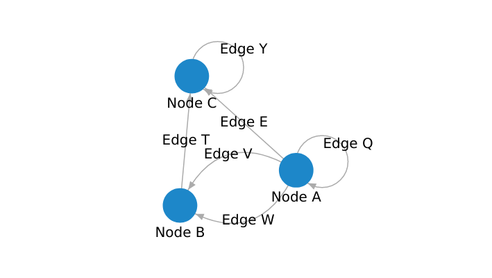
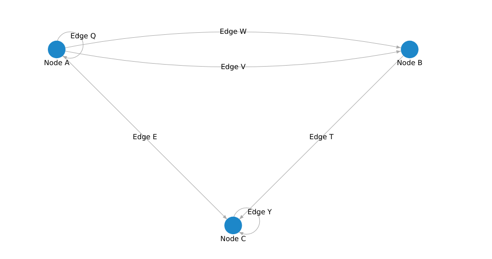

# Orb views: Default view

This is the default view that Orb uses to render a basic graph.

## Initialization

The `OrbView` doesn't need any additional configuration. You can, however, explicitly provide
if you want to assign fixed node coordinates, which you can read about further below.

```typescript
import { OrbView } from "@memgraph/orb";

const orb = new OrbView<MyNode, MyEdge>(container, optionalSettings);
```

You can set settings on view initialization or afterward with `orb.setSettings`. Below
you can see the list of all settings' parameters:

```typescript
interface IOrbViewSettings {
  // For custom node positions
  getPosition(node: INode): { x: number; y: number } | undefined;
  // For node positioning simulation (d3-force parameters)
  simulation: {
    isPhysicsEnabled: false;
    alpha: {
      alpha: number;
      alphaMin: number;
      alphaDecay: number;
      alphaTarget: number;
    };
    centering: null | {
      x: number;
      y: number;
      strength: number;
    };
    collision: null | {
      radius: number;
      strength: number;
      iterations: number;
    };
    links: {
      distance: number;
      strength?: number;
      iterations: number;
    };
    manyBody: null | {
      strength: number;
      theta: number;
      distanceMin: number;
      distanceMax: number;
    };
    positioning: null | {
      forceX: {
        x: number;
        strength: number;
      };
      forceY: {
        y: number;
        strength: number;
      };
    };
  };
  // For canvas rendering and events
  render: {
    fps: number;
    minZoom: number;
    maxZoom: number;
    fitZoomMargin: number;
    labelsIsEnabled: boolean;
    labelsOnEventIsEnabled: boolean;
    shadowIsEnabled: boolean;
    shadowOnEventIsEnabled: boolean;
    contextAlphaOnEvent: number;
    contextAlphaOnEventIsEnabled: boolean;
    backgroundColor: Color | string | null;
  };
  // For select and hover look-and-feel
  strategy: {
    isDefaultSelectEnabled: boolean;
    isDefaultHoverEnabled: boolean;
  };
  // For graph interaction
  interaction: {
    isDragEnabled: boolean;
  };
  // Other default view parameters
  zoomFitTransitionMs: number;
  isOutOfBoundsDragEnabled: boolean;
  areCoordinatesRounded: boolean;
  isSimulationAnimated: boolean;
  areCollapsedContainerDimensionsAllowed: boolean;
}
```

The default settings that `OrbView` uses is:

```typescript
const defaultSettings = {
  simulation: {
    isPhysicsEnabled: false;
    alpha: {
      alpha: 1,
      alphaMin: 0.001,
      alphaDecay: 0.0228,
      alphaTarget: 0.1,
    },
    centering: {
      x: 0,
      y: 0,
      strength: 1,
    },
    collision: {
      radius: 15,
      strength: 1,
      iterations: 1,
    },
    links: {
      distance: 30,
      iterations: 1,
    },
    manyBody: {
      strength: -100,
      theta: 0.9,
      distanceMin: 0,
      distanceMax: 3000,
    },
    positioning: {
      forceX: {
        x: 0,
        strength: 0.1,
      },
      forceY: {
        y: 0,
        strength: 0.1,
      },
    },
  },
  render: {
    fps: 60,
    minZoom: 0.25,
    maxZoom: 8,
    fitZoomMargin: 0.2,
    labelsIsEnabled: true,
    labelsOnEventIsEnabled: true,
    shadowIsEnabled: true,
    shadowOnEventIsEnabled: true,
    contextAlphaOnEvent: 0.3,
    contextAlphaOnEventIsEnabled: true,
    backgroundColor: null,
  },
  strategy: {
    isDefaultSelectEnabled: true,
    isDefaultHoverEnabled: true,
  },
  interaction: {
    isDragEnabled: true;
  },
  zoomFitTransitionMs: 200,
  isOutOfBoundsDragEnabled: false,
  areCoordinatesRounded: true,
  isSimulationAnimated: true,
  areCollapsedContainerDimensionsAllowed: false;
}
```

You can read more about each property down below and on [Styles guide](./styles.md).

### Property `getPosition`

There are two basic ways to use the `OrbView` API based on the node positions:

- **Simulated node positions** - Orb internally calculates and assigns coordinates to
  your nodes.
- **Fixed coordinates** - You provide node coordinates through the `getPosition()`
  callback function.

#### Simulated node positions

In this mode, the `OrbView` arranges node positions by internally calculating their
coordinates using the [D3.js](https://d3js.org/) library, or more specifically,
[`d3-force`](https://github.com/d3/d3-force). This method is applied by default - you don't
need to initialize Orb with any additional configuration.



```typescript
import { OrbView } from "@memgraph/orb";

const nodes: MyNode[] = [
  { id: 0, label: "Node A" },
  { id: 1, label: "Node B" },
  { id: 2, label: "Node C" },
];
const edges: MyEdge[] = [
  { id: 0, start: 0, end: 0, label: "Edge Q" },
  { id: 1, start: 0, end: 1, label: "Edge W" },
  { id: 2, start: 0, end: 2, label: "Edge E" },
  { id: 3, start: 1, end: 2, label: "Edge T" },
  { id: 4, start: 2, end: 2, label: "Edge Y" },
  { id: 5, start: 0, end: 1, label: "Edge V" },
];

const orb = new OrbView<MyNode, MyEdge>(container);

// Initialize nodes and edges
orb.data.setup({ nodes, edges });

// Render and recenter the view
orb.render(() => {
  orb.recenter();
});
```

#### Fixed node positions

If you want to assign specific coordinates to your graph, you can do this by providing the
`getPosition()` callback function. You can use this function to indicate which properties of
your original nodes will be in the returned `IPosition` object (`{ x: number, y: number }`)
that allows Orb to position the nodes.



```typescript
import { OrbView } from "@memgraph/orb";
const container = document.getElementById("graph");

const nodes: MyNode[] = [
  { id: 0, label: "Node A", posX: -100, posY: 0 },
  { id: 1, label: "Node B", posX: 100, posY: 0 },
  { id: 2, label: "Node C", posX: 0, posY: 100 },
];
const edges: MyEdge[] = [
  { id: 0, start: 0, end: 0, label: "Edge Q" },
  { id: 1, start: 0, end: 1, label: "Edge W" },
  { id: 2, start: 0, end: 2, label: "Edge E" },
  { id: 3, start: 1, end: 2, label: "Edge T" },
  { id: 4, start: 2, end: 2, label: "Edge Y" },
  { id: 5, start: 0, end: 1, label: "Edge V" },
];

const orb = new OrbView<MyNode, MyEdge>(container, {
  getPosition: (node) => ({ x: node.data.posX, y: node.data.posY }),
});

// Initialize nodes and edges
orb.data.setup({ nodes, edges });

// Render and recenter the view
orb.render(() => {
  orb.recenter();
});
```

You can use this callback function to assign fixed coordinates to your nodes.

The function has a node input (`INode`) which represents the Orb node data structure. You can
access your original properties through `.data` property. There you can find all properties of
your nodes that you assigned in the `orb.data.setup()` function.

Here you can use your original properties to indicate which ones represent your node coordinates
(`node.data.posX`, `node.data.posY`). All you have to do is return a `IPosition` that requires
2 basic properties: `x` and `y` (`{ x: node.data.posX, y: node.data.posY }`).

### Property `render`

Optional property `render` has several rendering options that you can tweak. Read more about them
on [Styling guide](./styles.md).

### Property `strategy`

The optional property `strategy` has two properties that you can enable/disable:

* `isDefaultSelectEnabled` - when `true`, the default selection strategy is used on mouse click:
  * If there is a node at the mouse click point, the node, its edges, and adjacent nodes will change
    its state to `GraphObjectState.SELECTED`. Style properties that end with `...Selected` will be
    applied to all the selected objects (e.g. `borderColorSelected`).
  * If there is an edge at the mouse click point, the edge and its starting and ending nodes will change
    its state to `GraphObjectState.SELECTED`.
* `isDefaultHoverEnabled` - when `true`, the default hover strategy is used on mouse move:
  * If there is a node at the mouse pointer, the node, its edges, and adjacent nodes will change its state to
    `GraphObjectState.HOVERED`. Style properties that end with `...Hovered` will be applied to all the
    hovered objects (e.g. `borderColorHovered`).

With property `strategy` you can disable the above behavior and implement your select/hover strategy on
top of events `OrbEventType.MOUSE_CLICK` and `OrbEventType.MOUSE_MOVE`, e.g:

```typescript
import { isNode, OrbEventType, GraphObjectState } from '@memgraph/orb';

// Disable default select and hover strategy
orb.setSettings({
  strategy: {
    isDefaultSelectEnabled: false,
    isDefaultHoverEnabled: false,
  },
});

// Create custom select strategy which selects just clicked node
orb.events.on(OrbEventType.MOUSE_CLICK, (event) => {
  // Clicked on blank canvas
  if (!event.subject) {
    // Deselect the previously selected nodes and render if there are changes
    const selectedNodes = orb.data.getNodes((node) => node.isSelected());
    if (selectedNodes) {
      selectedNodes.forEach((node) => node.clearState());
      orb.render();
    }
  }

  // Clicked on unselected node
  if (event.subject && isNode(event.subject) && !event.subject.isSelected()) {
    // Deselect the previously selected nodes
    orb.data.getNodes((node) => node.isSelected()).forEach((node) => node.clearState());
    // Select the new node
    event.subject.state = GraphObjectState.SELECTED;
    orb.render();
  }
});
```

### Property `interaction`

The optional property `interaction` has one property that you can enable/disable:

* `isDragEnabled` - property controls the dragging behavior within the application. When it is set to `true`, dragging is enabled, allowing users to interact with nodes and edges by dragging them to different positions within the graph. On the other hand, when `isDragEnabled`` is set to false, dragging functionality is disabled, preventing users from moving or repositioning nodes and edges through dragging interactions.

This property provides a straightforward way to enable or disable the dragging feature based on the needs and requirements of your application. By toggling the value of `isDragEnabled`, you can easily control whether users are allowed to interactively reposition elements within the graph by dragging them. e.g:

```typescript
// Disable default drag interaction
orb.setSettings({ interaction: { isDragEnabled: false } });
```

### Property `simulation`

Fine-grained D3 simulation engine settings. They include `isPhysicsEnabled`, `alpha`,
`centering`, `collision`, `links`, `manyBody`, and `positioning`. You can use `isPhysicsEnabled`
to enable or disable physics. You can read more about the other settings on the official
[`d3-force docs`](https://github.com/d3/d3-force). This may be condensed into fewer, more abstract
settings in the future.

### Property `zoomFitTransitionMs`

Use this property to adjust the transition time when recentering the graph. Defaults to `200ms`.

### Property `isOutOfBoundsDragEnabled`

Disabled by default (`false`).

### Property `areCoordinatesRounded`

Rounds node coordinates to integer values. Slightly improves performance. Enabled by default (`true`).

### Property `isSimulationAnimated`

Shows the process of simulation where the nodes are moved by the physics engine until they
converge to a stable position. If disabled, the graph will suddenly appear in its final position.
Enabled by default (`true`).

### Property `areCollapsedContainerDimensionsAllowed`

Enables setting the dimensions of the Orb container element to zero.
If the container element of Orb has collapsed dimensions (`width: 0;` or `height: 0;`),
Orb will expand the container by setting the values to `100%`.
If that doesn't work (the parent of the container also has collapsed dimensions),
Orb will set an arbitrary fixed dimension to the container.
Disabled by default (`false`).

## Settings

The above settings of the `OrbView` can be defined on view initialization, but also anytime
after the initialization with a view function `setSettings`:

```typescript
import { OrbView } from "@memgraph/orb";

const orb = new OrbView<MyNode, MyEdge>(container, {
  getPosition: (node) => ({ x: node.data.posY, y: node.data.posX }),
  zoomFitTransformMs: 1000,
  render: {
    shadowIsEnabled: false,
    shadowOnEventIsEnabled: false,
  },
});
```

```typescript
// If you want to see all the current view settings
const settings = orb.getSettings();

// Change the x and y axis
orb.setSettings({
  getPosition: (node) => ({ x: node.data.posY, y: node.data.posX }),
});

// Change the zoom fit and transform time while recentering and disable shadows
orb.setSettings({
  zoomFitTransformMs: 1000,
  render: {
    shadowIsEnabled: false,
    shadowOnEventIsEnabled: false,
  },
});
```

## Rendering

Just like other Orb views, use `render` to render the view and `recenter` to fit the view to
the rendered graph.

```typescript
orb.render(() => {
  orb.recenter();
});
```
