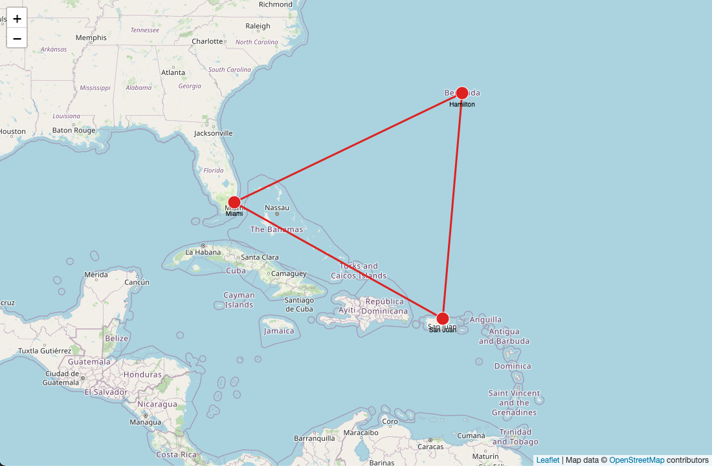

Orb views: Map view
===

By default, Orb offers a `MapView` which is a graph view with a map as a background. Map rendering is
done with a library [leaflet](https://leafletjs.com/). In order to render maps, make sure to add the
following CSS to your project:

```html
<link rel="stylesheet" href="https://unpkg.com/leaflet@1.8.0/dist/leaflet.css" />
```

Here is a simple example of `MapView` usage:



```typescript
const container = document.getElementById('<your-div-id>');

const nodes = [
  { id: 'miami', label: 'Miami', lat: 25.789106, lng: -80.226529 },
  { id: 'sanjuan', label: 'San Juan', lat: 18.4663188, lng: -66.1057427 },
  { id: 'hamilton', label: 'Hamilton', lat: 32.294887, lng: -64.781380 },
];
const edges = [
  { id: 0, start: 'miami', end: 'sanjuan' },
  { id: 1, start: 'sanjuan', end: 'hamilton' },
  { id: 2, start: 'hamilton', end: 'miami' },
]

const orb = new Orb(container);
orb.setView((context) => new MapView(context, {
  getGeoPosition: (node) => ({ lat: node.data.lat, lng: node.data.lng, }),
}));

// Assign a default style
orb.data.setDefaultStyle({
  getNodeStyle(node) {
    return {
      borderColor: '#FFFFFF',
      borderWidth: 1,
      color: '#DD2222',
      fontSize: 10,
      label: node.data.label,
      size: 10,
    };
  },
  getEdgeStyle() {
    return {
      arrowSize: 0,
      color: '#DD2222',
      width: 3,
    };
  },
});

// Initialize nodes and edges
orb.data.setup({ nodes, edges });

// Render and recenter the view
orb.view.render(() => {
  orb.view.recenter();
});
```

## Initialization

On `MapView` initialization you must provide an implementation for `getGeoPosition` which is used
to get `latitude` and `longitude` for each node. Here is the example of settings (required and optional)
initialized on the new `MapView`:

```typescript
import * as L from 'leaflet';

const mapAttribution =
  '<a href="https://leafletjs.com/" target="_blank" >Leaflet</a> | ' +
  'Map data &copy; <a href="https://www.openstreetmap.org/">OpenStreetMap</a> contributors';

orb.setView((context) => new MapView(context, {
  getGeoPosition: (node) => ({ lat: node.data.latitude, lng: node.data.longitude, }),
  map: {
    zoomLevel: 5,
    tile: {
      instance: new L.TileLayer('https://{s}.tile.openstreetmap.org/{z}/{x}/{y}.png'),
      attribution: mapAttribution,
    },
    render: {
      labelsIsEnabled: true,
      labelsOnEventIsEnabled: true,
      shadowIsEnabled: true,
      shadowOnEventIsEnabled: true,
      contextAlphaOnEvent: 0.3,
      contextAlphaOnEventIsEnabled: true,  
    },
  },
}));
```

### Property `getGeoPosition`

Property `getGeoPosition` is the only required one. It is a callback function that has a node (`INode`)
as an input, and it needs to return object `{ lat: number; lng: number; }` or `undefined`. If `undefined`
is returned those nodes won't be rendered on the map.

### Property `map`

Optional property `map` has two properties that you can set which are:

* `zoomLevel` - initial map zoom level. Zoom level is forwarded to `leaflet`.
* `tile` - map tile layout where you need to provide an instance (`leaflet.TileLayer`) and attribution.
  Default tile is the OpenStreetMaps.

### Property `render`

Optional property `render` has several rendering options that you can tweak. Read more about them
on [Styling guide](./styles.md).

## Settings

The above settings of `MapView` can be defined on view initialization, but also anytime after the
initialization with a view function `setSettings`:

```typescript
// If you want to see all the current view settings
const settings = orb.view.getSettings();

// Change the way how geo coordinates are defined on nodes
orb.view.setSettings({
  getGeoPosition: (node) => ({ lat: node.data.lat, lng: node.data.lng, }),
});

// Change the zoom level and disable shadows
orb.view.setSettings({
  map: {
    zoomLevel: 7,
  },
  render: {
    shadowIsEnabled: false,
    shadowOnEventIsEnabled: false,
  },
});
```

## Rendering

Just like other Orb view, use `render` to render the view and `recenter` to fit the view to
the rendered graph.

```typescript
orb.view.render(() => {
  orb.view.recenter();
});
```

## Map reference `leaflet`

If you need a reference to the internal map reference from `leaflet` library, just use the
following example:

```typescript
// It will only work on MapView
const leaflet = orb.view.leaflet;
```
